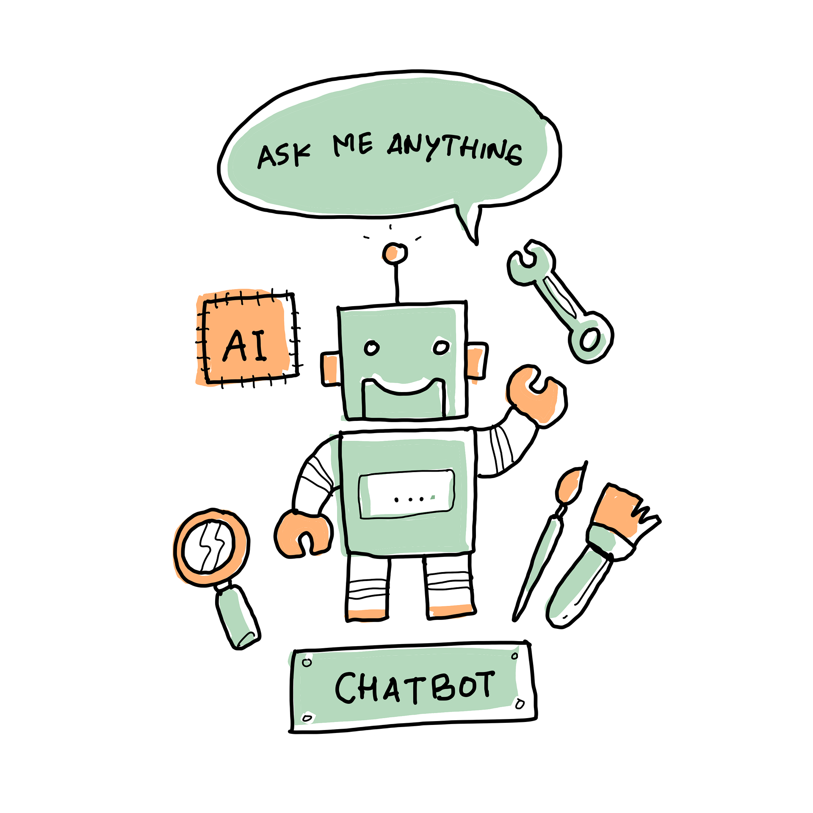

# Botticelli
Botticelli framework: a chat bot development platform for .NET 



There are several reasons to choose Botticelli:
- cross-platform
- reliable
- easy to use
- easy to deploy(docker support)
- easy to integrate with databases
- easy to integrate with AI solutions (Botticelli.AI)
- easy to integrate with speech synthesizers (Botticelli.Talks)
- easy to integrate with queue brokers for highload systems (Botticelli.Bus)
- easy to schedule (Botticelli.Scheduler)

# Getting Started

## Short summary
Botticelli consists of 2 parts: 
- Bots
- Server

On server side we can add new bots, change and check their state (active/non-active).
On a bot side we can implement any business logic we want.

## Requirements
1. .Net Core 7
2. Visual Studio 2022 and higher/Rider

## Building from source

1. Clone a git repository: ``` git clone https://github.com/devgopher/botticelli.git ```
2. Open Botticelli.sln in VS'2022/Rider
3. Examples of usage are in Samples subfolder

## Registering a Telegram bot
1. Register a bot account: https://core.telegram.org/bots/tutorial#introduction
2. Save your Bot Token

## Starting a sample project
1. Go to a folder and edit appsettings.json this way:
```
{
  "Logging": {
    "LogLevel": {
      "Default": "Information",
      "Microsoft.AspNetCore": "Warning"
    }
  },
  "SampleSettings": {
    "SecureStorageConnectionString": "Filename=../../../database.db;Password=123;ReadOnly=true" // path to a secure storage db, you may you own
  },
  "ServerSettings": {
    "ServerUri": "http://localhost:5050" // path to an admin server, your may configure it (don't forget to check your server settings)
  },
  "AllowedHosts": "*"
}

```
2. Start a sample bot project at Samples\TelegramMessagingSample. Run run_standalone.sh.
3. After the first run of a bot-project(Samples\TelegramMessagingSample in pour case), you should find Data\botId file with a generated botId
4. Copy a generated *botId* into a clipboard
5. In your browser run https://localhost:7247 (Admin panel).
6. Login with creds: login admin1@botticellibots.com and password 12345678
7. Go to "Your bots" page
8. Click "Add Bot" button, put in your *botId* and click "Save"
9. Create some new chat/group with your bot (Notice! In order to read messages from a group, your bot account needs admin priveleges!)
10. On "Your bots" page click "start/stop" button in order to activate your bot. Here you can track it's status (alive/dead).
11. Enjoy!
